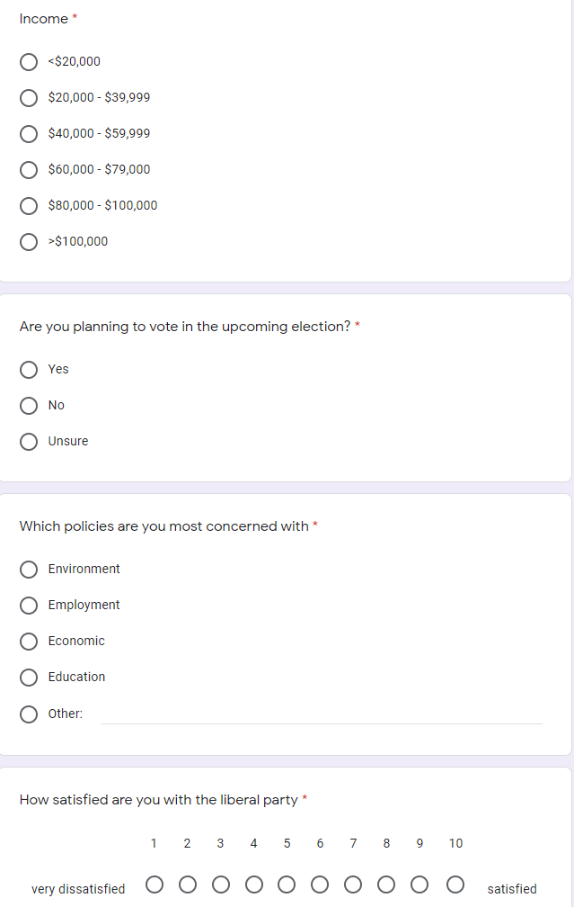
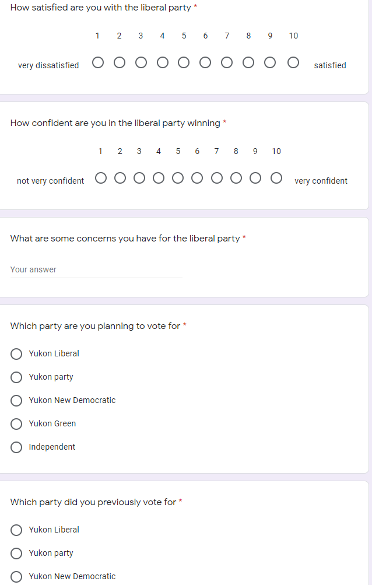
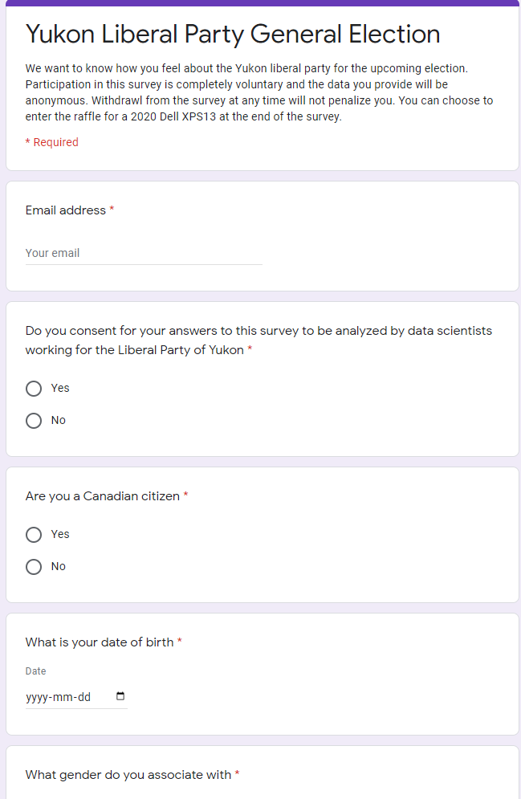

Resources Used: 
https://electionsyukon.ca/sites/elections/files/english_website_2016_election_report_1.56.55_pm.pdf

https://www12.statcan.gc.ca/census-recensement/2016/dp-pd/prof/details/Page.cfm?Lang=E&Geo1=PR&Code1=60&Geo2=&Code2=&SearchText=Yukon&SearchType=Begins&SearchPR=01&B1=All&GeoLevel=PR&GeoCode=60&type=0

https://www.statcan.gc.ca/eng/dai/smr08/2015/smr08_203_2015#a1

https://www.yukon-news.com/news/yukon-voter-turnout-second-highest-in-the-country/


```{r setup, include=FALSE}
knitr::opts_chunk$set(echo = TRUE)
set.seed(10)
library(splitstackshape)
library(dplyr)
library(ggplot2)
library(scales)
```
## Executive Summary

Yukon, Canada's westernmost and least populated province, has long been neglected by political parties for a variety of reasons. However, Yukon's importance in nature conservation and mining development is self-evident. In this paper, we will explore Yukon's voter dataset from a survey conducted by our team. With the support of the Yukon Liberal Party, we successfully gathered comprehensive data of the Yukon population which include demographics, political preferences, income levels, and educational backgrounds. We divided voters into groups based on their educational background, where they live and which policy they support and then analyzed which party they will vote for. We found some very useful results, for instance, people who live in Pelly-Nisutlin prefer Liberal Party. The New Democratic Party’s supporters care more about the environment and so on. However, we recognize that the results of the current analysis represent a preliminary observation of the limitations inherent in such a large record. In addition to the limitations of using large survey data sets discussed earlier, this study is also constrained by budget. For example, most of our data are derived from densely populated urban areas, thus ignoring the universality of the data. So, our future work will focus on understanding and measuring the sparsely populated suburbs of Yukon. In conclusion, with reliable data sources and our team's efficient data analysis methods, our findings are sure to provide a valuable reference for the Yukon Liberal party in the 2020 federal election.

## Introduction


## Survey Methodology

The population we focused on was eligible voters in Yukon. While there may be some merit to finding the opinions of Non-Citizens and those who will be eligible to vote in the election following, we found that in terms of the immediate helpfulness only those that will influence the upcoming election are people of interest. There were quite a few avenues through which to pursue how the survey would be done. Initially, we wanted to have surveys done in person at grocery stores. Upon completion of the survey, the respondent would have been entered into a raffle for a free laptop. We chose a laptop as a relatively expensive reward and one that appeals to the largest number of people without being something too basic, such as pure cash. A big issue with this methodology is the fact that not everyone attends a grocery store, and even if someone from a household comes, that doesn't necessarily mean they speak for every eligible voter that lives with them. This limits the frame to eligible voters that happen to go to grocery stores. However, the idea of a reward was appealing, so that maintained. Another method was phone surveys. Phone surveys could reach a person regardless of location. The next problem came in the form of what the frame would be. One option was simply generating every single local number and trying calling each one. This would be quite expensive, especially as many of these numbers wouldn’t belong to anyone. However, the benefit of this would be a much wider range than if we had simply used census data, as we reach the unlisted numbers. Unlisted numbers make up a huge amount of potential respondents than would be otherwise missed. For example, according to an article from the CBC, in 2017 Saskatchewan was home to more than 600,000 unlisted numbers, compared to their population at the time of about 1.2 Million. As time goes on, unlisted numbers will only grow more and more in number, and ignoring them would not only miss a huge number of people, but also the younger demographics who are much more likely to have an unlisted number. As such, we found this to be the best form of survey methodology. A potential issue that could, and most likely will, arise is Non-Response. However, in both having a reward for completing the survey, so that respondents would be more motivated to participate, and casting a very wide net, we believe that this a reasonable approach to mitigate this problem.

## Survey Design and Motivation

This survey is designed to categorize the citizens of Yukon by their income levels, education background, and socio political leanings. The categories can then be associated with the districts of Yukon to prepare and inform the Yukon liberal party to come up with appropriate campaigning strategies for the district.
The survey is hosted on Google Forms so it is easily accessible for almost everyone granted they have a device that can access the internet. It is made short and simple with mostly multiple choice questions to maximize the accessibility and completion rate. The respondents can take the survey at home or in designated locations such as a Walmart, they can expect a simple straightforward survey that will take no more than 5 minutes. 
Taking the survey requires a valid email, this is to disencourage multiple submissions from the same individual. The first 3 questions are to determine if the data obtained from this person is relevant for the upcoming election. If the person is under 18 or not a Canadian citizen, their data can still provide additional information that contributes to the overall analysis, but should be noted that they are not eligible to vote for the election. The next 2 questions will ask about their sexual identity and preference, this is to determine the social aspect of the respondent. Then we ask about income and education, we can use the answers to categorize the respondent based on these factors as well. The rest of the questions are able to place the respondent on a political spectrum and obtain their political leanings. In a few simple and basic questions, we are able to obtain a respondents social, economic, and political backgrounds.


```{r Creating Potential Values, echo=FALSE}
District_Names <- c("Copperbelt North", "Copperbelt South", "Klondike", "Kluane", "Lake Laberge", "Mayo-Tatchun", "Mount Lorne-Southern Lakes", "Mountainview", "Pelly-Nisutlin", "Porter Creek Centre", "Porter Creek North", "Porter Creek South", "Riverdale North", "Riverdale South", "Takhini-Kopper King", "Vuntut Gwitchin", "Watson Lake", "Whitehorse Centre", "Whitehorse West")
District_Eligible_Voters <- c(1684, 1510, 1399, 927, 1497, 1044, 1522, 1537, 836, 1379, 1546, 890, 1413, 1471, 1904, 175, 936, 1640, 1368)
Gender_Values <- c("Male", "Female", "Other", "Prefer Not To Say")
Education_Values <- c("No Schooling", "High School Graduate or Equivalent", "Post-Secondary Degree", "Masters/PhD or equivalent", "Prefer Not to Say")
Sexual_Preference_Values <- c("Heterosexual", "Homosexual", "Bisexual", "Other", "Prefer Not to Say")
Income_Values <- c("<$20,000", "$20,000 to $39,999", "$40,000 to $59,999", "$60,000 to $79,999", "$80,000 to $100,000", ">$100,000")
Voting_Values <- c("Yes", "No", "Unsure")
Important_Policy_Values <- c("Environment", "Economy", "Education", "Employment", "Other")
Party_Values <- c("Independent", "Yukon Green Party", "Yukon Liberal Party", "Yukon New Democratic Party", "Yukon Party")
```

```{r Create The Total Population, echo=FALSE}
# Creating Districts based off of eligible voters per district
Districts <- c()

for (district in 1:length(District_Names)) {
  Districts <- append(Districts, rep(District_Names[district], District_Eligible_Voters[district]))
}

Eligible_Voters <- sum(District_Eligible_Voters)

Genders <- sample(Gender_Values, Eligible_Voters, replace = TRUE, prob = c(0.502, 0.496, 0.001, 0.001))
Education <- sample(Education_Values, Eligible_Voters, replace = TRUE, prob = c(0.17, 0.23, 0.5, 0.1, 0.05))
Sexual_Preferences <- sample(Sexual_Preference_Values, Eligible_Voters, replace = TRUE, prob = c(0.96, 0.017, 0.013, 0.05, 0.05))
Income <- sample(Income_Values, Eligible_Voters, replace = TRUE, prob = c(0.2, 0.2, 0.15, 0.15, 0.1, 0.1))
Voting <- sample(Voting_Values, Eligible_Voters, replace = TRUE, prob = c(0.76, 0.14, 0.1))
Policy <- sample(Important_Policy_Values, Eligible_Voters, replace = TRUE)
Satisfaction <- sample(1:10, Eligible_Voters, replace = TRUE)
Confidence <- sample(1:10, Eligible_Voters, replace = TRUE)
Party_Voting <- sample(Party_Values, Eligible_Voters, replace = TRUE, prob = c(0.01, 0.04, 0.4, 0.25, 0.33))
Party_Prev <- sample(Party_Values, Eligible_Voters, replace = TRUE, prob = c(0.01, 0.04, 0.4, 0.25, 0.33))

Data <- data.frame(Districts, Genders, Education, Sexual_Preferences, Income, Voting, Policy, Satisfaction, Confidence, Party_Voting, Party_Prev)

```

```{r Sampling via SRSWOR, echo=FALSE}
SRSWOR_Rows <- sample(nrow(Data), Eligible_Voters/10)
SRSWOR_Sample <- slice(Data, SRSWOR_Rows)
```

```{r Sampling via StRS, echo=FALSE}
StRS_Sample <- stratified(Data, "Districts", .1)
```
## Findings

```{r Votes, echo=FALSE}
voters <- filter(StRS_Sample, Voting == "Yes")
votes <- voters %>% ggplot(aes(x = Party_Voting)) + geom_bar(aes(y = (..count..)/sum(..count..))) + labs(title = "The Party of Choice Among Voters in Yukon", caption = "Figure 1", x = "Party of Choice", y= "Percentage of Votes") + scale_y_continuous(labels = percent) + scale_x_discrete(guide = guide_axis(n.dodge = 2)) + theme_light()
votes
```
```{r policies, echo=FALSE}
policies <- ggplot(voters %>% count(Party_Voting, Policy) %>% mutate(pct = n/sum(n)), aes(x = Party_Voting, y = n, fill = Policy)) + geom_bar(stat="identity", position = "fill") + labs(title = "Most Important Policy Among Voters in Yukon Compared to Party of Choice", caption = "Figure 2", x = "Party of Choice", y= "Percentage of Votes") + scale_y_continuous(labels = percent) + scale_x_discrete(guide = guide_axis(n.dodge = 2)) + theme_light()
policies
```
```{r Satisfaction, echo=FALSE, message=FALSE, warning=FALSE}
average_satisfaction <- voters %>% group_by(Party_Voting) %>% summarise(avg = mean(Satisfaction)) %>% ggplot(aes(x = Party_Voting, y = avg)) + geom_bar(stat = "identity") + labs(title = "Satisfaction with the Yukon Liberal Party Among Voters by Party of Choice", caption = "Figure 3", x = "Party of Choice", y= "Satisfaction") + ylim(0,10) + scale_x_discrete(guide = guide_axis(n.dodge = 2)) + theme_light()
average_satisfaction
```
```{r Confidence, echo=FALSE, message=FALSE, warning=FALSE}
average_confidence <- voters %>% group_by(Party_Voting) %>% summarise(avg = mean(Confidence)) %>% ggplot(aes(x = Party_Voting, y = avg)) + geom_bar(stat = "identity") + labs(title = "Confidence for the Yukon Liberal Party Among Voters by Party of Choice", caption = "Figure 4", x = "Party of Choice", y= "Confidence") + ylim(0,10) + scale_x_discrete(guide = guide_axis(n.dodge = 2)) + theme_light()
average_confidence
```
```{r Party, echo=FALSE}
party_by_district <- ggplot(voters %>% count(Districts, Party_Voting), aes(x = Districts, y = n, fill = Party_Voting)) + geom_bar(stat="identity", position = "fill") + labs(title = "Party Voted for Among Voters in Yukon by District", caption = "Figure 5", x = "District", y= "Percentage of Voters") + scale_y_continuous(labels = percent) + theme(axis.text.x = element_text(angle = 90, vjust = 0.5, hjust = 1), aspect.ratio = 1/2)
party_by_district
```
```{r Income by District, echo=FALSE}
voters$Income <- factor(voters$Income, levels = Income_Values)
income_by_district <- ggplot(voters %>% count(Districts, Income), aes(x = Districts, y = n, fill = Income)) + geom_bar(stat="identity", position = "fill") + labs(title = "Income Among Voters in Yukon by District", caption = "Figure 6", x = "District", y= "Percentage of Voters") + scale_y_continuous(labels = percent) + theme(axis.text.x = element_text(angle = 90, vjust = 0.5, hjust = 1), aspect.ratio = 1/2)
income_by_district
```
```{r Satisfaction by district, echo=FALSE, message=FALSE, warning=FALSE}
satisfaction_by_district <- voters %>% group_by(Districts) %>% summarise(avg = mean(Satisfaction)) %>% ggplot(aes(x = Districts, y = avg)) + geom_bar(stat = "identity") + labs(title = "Satisfaction with the Yukon Liberal Party Among Voters by District", caption = "Figure 7", x = "District", y= "Satisfaction") + ylim(0,10) + theme(axis.text.x = element_text(angle = 90, vjust = 0.5, hjust = 1), aspect.ratio = 1/2)
satisfaction_by_district
```

```{r Education, echo=FALSE}
voters$Education <- factor(voters$Education, levels = Education_Values)
party_by_education <- ggplot(voters %>% count(Education, Party_Voting), aes(x = Education, y = n, fill = Party_Voting)) + geom_bar(stat="identity", position = "fill") + labs(title = "Party Voted for Among Voters in Yukon by Highest Level of Education", caption = "Figure 8", x = "Highest Level of Education", y= "Percentage of Votes") + scale_y_continuous(labels = percent) + theme(axis.text.x = element_text(angle = 90, vjust = 0.5, hjust = 1), aspect.ratio = 1/2)
party_by_education
```
```{r Education by District, echo=FALSE}
education_by_district <- ggplot(voters %>% count(Districts, Education), aes(x = Districts, y = n, fill = Education)) + geom_bar(stat="identity", position = "fill") + labs(title = "Highest Level of Education Among Voters in Yukon by District", caption = "Figure 9", x = "District", y= "Percentage of Voters") + scale_y_continuous(labels = percent) + theme(axis.text.x = element_text(angle = 90, vjust = 0.5, hjust = 1), aspect.ratio = 1/2)
education_by_district
```
```{r Policy by District, echo=FALSE}
Policy_by_district <- ggplot(voters %>% count(Districts, Policy), aes(x = Districts, y = n, fill = Policy)) + geom_bar(stat="identity", position = "fill") + labs(title = "Most Important Policy Among Voters in Yukon by District", caption = "Figure 10", x = "District", y= "Percentage of Voters") + scale_y_continuous(labels = percent) + theme(axis.text.x = element_text(angle = 90, vjust = 0.5, hjust = 1), aspect.ratio = 1/2)
Policy_by_district
```
```{r Gender by District, echo=FALSE}
Gender_by_district <- ggplot(voters %>% count(Districts, Genders), aes(x = Districts, y = n, fill = Genders)) + 
  geom_bar(stat = "identity", position="fill") + 
  labs(title = "Gender Among Voters in Yukon by District", caption = "Figure 11", x = "District", y= "Percentage of Voters") +    
  scale_y_continuous(labels = percent) + 
  theme(axis.text.x = element_text(angle = 90, vjust = 0.5, hjust = 1))
Gender_by_district
```
```{r Gender by Party, echo=FALSE}
Gender_by_party <- ggplot(voters %>% count(Party_Voting, Genders), aes(x = Party_Voting, y = n, fill = Genders)) + 
  geom_bar(stat = "identity", position="fill") + 
  labs(title = "Gender Among Voters in Yukon by Party of Choice", caption = "Figure 12", x = "Party", y= "Percentage of Voters") +    
  scale_y_continuous(labels = percent) + 
  scale_x_discrete(guide = guide_axis(n.dodge = 2)) + theme_light()
Gender_by_party
```

The main focus of this report is to share information regarding the voters of Yukon to the Yukon Liberal Party. Rather than give advice regarding particular policy decisions or campaigning strategies, we found it best to find and put together as much data as possible from which the Yukon Liberal Party can base their future actions off of. Given the material of the survey previously discussed, there were quite a few different points of interest to share. 
Figure 1 dictates a fairly simple relationship regarding who voters plan to vote for. The results are fairly similar to those of the previous election. However, this does mean that while the Yukon Liberal Party has the lead, the other two main contenders are not far behind, so there’s no room to rest on laurels at this time without maintaining the strength of the party and improving beyond that to reach a greater audience.
    Moving forward, Figure 2 outlines the most important policy for voters based on which party they plan to vote for. As you can see, there’s not too much variation between parties. That said, two key observations are that, as a group, Independent voters weigh the economy much heavier than other issues relative to the other parties. The other observation of note is that the percentage of those who plan to vote for the Yukon Party that find the environment to be their primary issue is greater than that of all other parties, whereas the voters who plan to vote for the Yukon Liberal Party tend to not consider it their highest priority, so this may be something to look into.
    Figures 3 and 4 describe the satisfaction and confidence that voters have towards the Yukon Liberal Party based on their party of choice respectively. Most people are more satisfied than not across the grid, but not by a significant factor, so this is for sure an area to improve upon. Confidence is the same, with the exception of Independent voters being slightly less confident in the Yukon Liberal Party.
    Figures 5, 6, 7, 9, 10, and 11 compare voters in each electoral district to their party of choice, their income, their satisfaction with the Yukon Liberal Party, their highest level of education, their most important policy, and their gender breakdown respectively. These figures serve to aid any campaigning efforts in each of these places, as understanding and appealing to these demographics in each district will surely contribute heavily to re-election efforts. 
The remaining two plots, Figures 8 and 12, highlight supplemental information that we believed may be important, with Figure 8 describing how voters plan on voting based on their highest level of education and Figure 12 based on their gender.
    We are certain that the information obtained from these findings will be of great use during future policy planning and campaigning efforts.


## Shortcomings and biases

Assuming that nobody lies on survey for the sake of the laptop, there are multiple weaknesses which might lead to inconclusive results. There is an inevitable problem of missing data as people may choose not to answer specific questions or take the survey, invalidating generalization to the population. Additionally, the method of distribution remains insufficient to reach every single inhabitant of the province, depriving us of valuable information/data. By trying to reach everyone through their phones, there might arise the problem of overlapping information as respondents could possess multiple phone numbers. External factors (or lurking variables) such as the economic conditions caused by the current pandemic, and policies considered personally irrelevant amongst the sample, can lead to biased answers against the party. Moreover, respondents can find the survey tedious due to its length, rendering inaccurate and unfavorable answers.

## Benefits for the Party

As victors of the previous elections, it is definitely in the party’s best interests to conduct this survey, in order to gage their chances of being re-elected. Our use of stratified random sampling from the population, based on electoral districts allows the party to recognize potential voters, and favorable districts. It also helps them to identify voters’ concerns about relevant issues. The survey and the graphs depicted in our report give a clear comparison of the voter demographics, based mostly on districts. As a result, the party can compare statistics, identify relevant information - developing and improving their campaigning strategy accordingly, thereby, ensuring their possibility of being re-elected.

## Opportunities for Future Work

We recognize that the results of the current analysis represent a preliminary observation of the limitations inherent in such a large record. In addition to the limitations of using large survey data sets discussed earlier, this study is also constrained by budget. Some of our data sources focus on supermarkets with many customers, thus ignoring the universality of the data. However, our data seem to support the argument that the Liberal Party should make economic development and the improvement of people's living standards as its main objectives. Therefore, our future work will focus on understanding and surveying the suburbs of the sparsely populated Yukon province. Research shows that education levels in remote Yukon areas lag far behind those in other Canadian regions, yet indigenous people here make up about a quarter of the province's population. So, researching and understanding the political will of the indigenous people will largely determine the outcome of the Liberal election.

## Appendix

Simple Random Sampling : A sampling technique where everyone is chosen entirely by chance and each member of the population has an equal chance of being included in the sample.

Stratified Random Sampling : A method of sampling that involves the division of a population into smaller groups, the smaller groups are formed based on members’ shared attributes or characteristics, and everyone of each group has an equal chance of being included in the sample.

Link to Survey: https://docs.google.com/forms/d/e/1FAIpQLSeKtBfexOZDvcqszeNDH_dL5x3bkHHV4jNet4fdUS9Iv5-V3w/viewform?usp=sf_link

Screenshots of the Survey: 
```{r survey_pics, echo=FALSE}





```


## References
